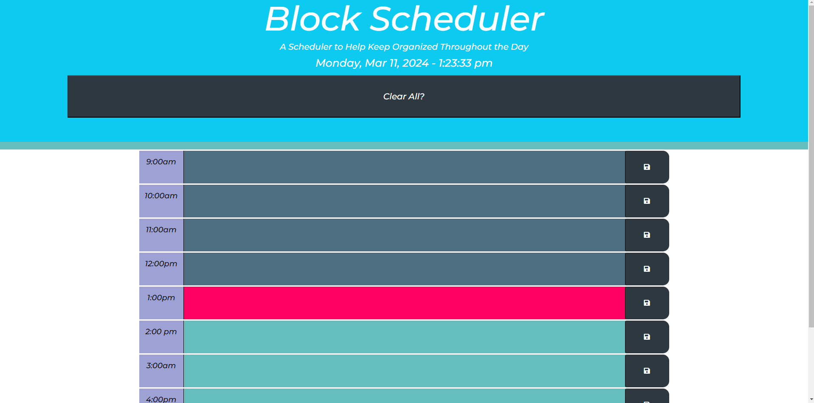

# Block Scheduler

## Table of Contents

- [Description](#description)
- [User Story](#user-story)
- [Acceptance Criteria](#acceptance-criteria)
- [Images](#images) 
- [Link To Deployed Webpage](#link-url-to-deployed-webpage)
- [Installation](#installation)
- [Technologies Used](#technologies-used)
- [Third Party APIs](#third-party-apis)
- [Credits](#credits)
- [License](#license)

## Description

The main goal of this website was to show the skills we learned in Third Party APIs to create a Workday Scheduler. You can log your TODOs for the day in segmented timeblocks for the current day.
- DarkBlue : Past
- Pink : Present
- LightBlue : Future

## User Story

- AS AN employee with a busy schedule
- I WANT to add important events to a daily planner
- SO THAT I can manage my time effectively

## Acceptance Criteria

- GIVEN I am using a daily planner to create a schedule
- WHEN I open the planner
- THEN the current day is displayed at the top of the calendar
- WHEN I scroll down
- THEN I am presented with time blocks for standard business hours
- WHEN I view the time blocks for that day
- THEN each time block is color-coded to indicate whether it is in the past, present, or future
- WHEN I click into a time block
- THEN I can enter an event
- WHEN I click the save button for that time block
- THEN the text for that event is saved in local storage
- WHEN I refresh the page
- THEN the saved events persist

## Images

## Link URL to deployed webpage
https://hammerc124.github.io/Time-Block-Scheduler/

## Technologies Used
Assignment was built with:
- HTML5
- Advanced CSS
- JavaScript
- JQuery
- Bootstrap
- VS Code
- Github

## Third Party APIs 
- https://releases.jquery.com/
- https://cdnjs.com/
- https://momentjs.com/
- https://fontawesome.com/
- https://getbootstrap.com/

## Credits
- Webpage: Caleb Hammer
- Course: Full Stack Developement Bootcamp
- Instructor: Ragheed Al-midani